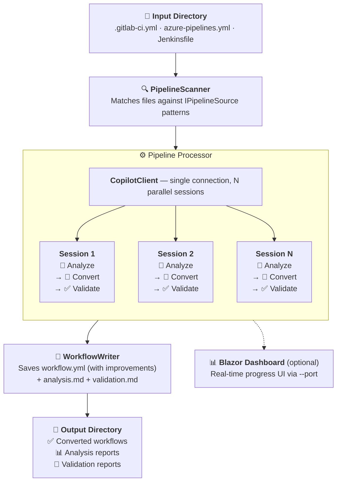

# Pipeline to GitHub Actions Converter

> [!WARNING]
> This project is experimental and under active development. Features may change without notice and the generated workflows should be reviewed carefully before use in production.

🌐 **[Project website »](https://frank802.github.io/ghcp-action-importer/)**

A .NET 10 application that converts CI/CD pipelines from GitLab, Azure DevOps, and Jenkins to GitHub Actions using the [GitHub Copilot SDK](https://github.com/github/copilot-sdk).

## Features

- **Multi-source support**: Convert pipelines from GitLab CI, Azure DevOps, and Jenkins
- **AI-powered conversion**: Uses GitHub Copilot to intelligently map pipeline constructs to GitHub Actions
- **Pre-conversion analysis**: Copilot-powered analysis evaluates pipeline complexity, identifies risks, flags unsupported features, and can block conversion on critical issues
- **Custom prompts**: Customizable prompt files drive each phase (analysis, conversion, validation)
- **Validation**: Validates generated workflows for:
  - YAML syntax correctness
  - GitHub Actions structure requirements
  - Security best practices
  - Action version pinning
- **Live web dashboard**: Optional Blazor Server dashboard (`--port`) for real-time conversion progress monitoring
- **Extensible architecture**: `IPipelineSource` interface allows easy addition of new pipeline sources
- **Detailed reports**: Generates analysis and validation reports with suggestions for improvements
- **Auto-improved workflows**: Validation improvements are applied directly to the output workflow
- **Analysis-informed conversion**: Analysis findings (risks, unsupported features, complexity) are injected into the conversion prompt for higher-quality output

## How It Works



1. **Scan** — `PipelineScanner` walks the input directory and matches files against registered `IPipelineSource` implementations (GitLab, Azure DevOps, Jenkins). Each matched file is read and wrapped in a `PipelineInfo` object.

2. **Connect** — A single `CopilotClient` is created and connects to GitHub Copilot via the CLI. A `SemaphoreSlim` throttles work to `MaxParallelSessions` concurrent sessions.

3. **Analyze** — For each pipeline, a dedicated Copilot session is created. The `CopilotAnalysisService` loads the analyzer prompt via `PromptLoader` and sends the pipeline content to Copilot. It evaluates complexity (Low/Medium/High/Critical), identifies risks and unsupported features, and estimates conversion effort. If `BlockOnCritical` is enabled and the analyzer flags a critical block, conversion is skipped for that pipeline.

4. **Convert** — In the *same* session (preserving analysis context), the `CopilotConverterService` loads the converter prompt and sends the pipeline content to Copilot. Analysis findings (risks, unsupported features, complexity) are explicitly injected into the prompt so the converter can add TODO comments and handle edge cases. The model returns a GitHub Actions workflow in a YAML code block, which is extracted and saved.

5. **Validate** — Still in the same session, the `CopilotValidationService` loads the validator prompt and sends the original pipeline and converted workflow to Copilot. The validator checks syntax, security, and action pinning, then returns issues, suggestions, and an improved workflow.

6. **Write** — `WorkflowWriter` saves the workflow file (overwriting with the improved version if one was produced), generates an `.analysis.md` report, and generates a `.validation.md` report.

7. **Report** — Console output summarizes results per pipeline (complexity, risks, errors, warnings, suggestions, duration). If `--port` was specified, the Blazor Server dashboard shows live progress throughout all phases including analysis.

## Prerequisites

- [.NET 10 SDK](https://dotnet.microsoft.com/download)
- [GitHub Copilot CLI](https://docs.github.com/en/copilot/how-tos/set-up/install-copilot-cli) installed and authenticated
- Active GitHub Copilot subscription

## Quick Start

```bash
git clone https://github.com/Frank802/ghcp-action-importer.git
cd ghcp-action-importer/src
dotnet build
```

Run the converter on the included sample pipelines:

```bash
dotnet run -- -i ../samples -o ../output -v
```

This will convert:
- GitLab CI (`.gitlab-ci.yml`) — Node.js build/test/deploy pipeline
- Azure DevOps (`azure-pipelines.yml`) — .NET multi-stage pipeline
- Jenkins (`Jenkinsfile`) — Java Maven with Docker and Kubernetes

Output will be saved to `output/` with:
- Converted workflow files (`.yml`)
- Validation reports (`.validation.md`)

## Usage

```bash
# Basic usage
dotnet run -- -i <input-folder> -o <output-folder>

# Convert only GitLab pipelines with verbose output
dotnet run -- -i ./pipelines -o ./converted -s GitLab --verbose

# Skip validation step
dotnet run -- -i ./ci -o ./output --skip-validation

# Skip analysis step
dotnet run -- -i ./ci -o ./output --skip-analysis

# Launch with live web dashboard
dotnet run -- -i ./ci -o ./output -p 5050
```

### Command Line Options

| Option | Alias | Description |
|--------|-------|-------------|
| `--input` | `-i` | **Required.** Directory containing pipeline files to convert |
| `--output` | `-o` | **Required.** Output directory for converted workflows |
| `--source` | `-s` | Filter to specific source type: `GitLab`, `AzureDevOps`, `Jenkins` |
| `--max-sessions` | `-m` | Maximum parallel Copilot sessions (default: 3) |
| `--port` | `-p` | Start a Blazor Server dashboard on the given port |
| `--skip-validation` | | Skip the validation step after conversion |
| `--skip-analysis` | | Skip the pre-conversion analysis step |
| `--verbose` | `-v` | Enable verbose output |
| `--help` | `-h` | Show help message |

## Live Dashboard

Pass `--port` to launch an interactive Blazor Server dashboard that displays real-time conversion progress:

```bash
dotnet run -- -i ../samples -o ../output -p 5050
```

The dashboard shows:
- Overall progress bar with completion percentage
- Per-pipeline status cards with phase indicators (analyzing, converting, validating, writing, complete/failed)
- Source type badges (GitLab, Azure DevOps, Jenkins)
- Elapsed time per pipeline and total processing time
- Error details for failed conversions

The dashboard stays running after processing completes — press Ctrl+C to stop.

## Supported Pipeline Formats

| Source | File Patterns |
|--------|---------------|
| GitLab CI/CD | `.gitlab-ci.yml`, `.gitlab-ci.yaml` |
| Azure DevOps | `azure-pipelines.yml`, `azure-pipelines.yaml` |
| Jenkins | `Jenkinsfile`, `Jenkinsfile.*` |

## Output Structure

Converted workflows are saved to the output directory. When `CreateWorkflowsSubdirectory` is enabled, the structure is:

```
<output-folder>/
└── .github/
    └── workflows/
        ├── gitlab-ci.yml           # Converted workflow (with improvements applied)
        ├── gitlab-ci.analysis.md   # Analysis report (complexity, risks, effort)
        └── gitlab-ci.validation.md # Validation report
```

When disabled (default), files are written directly to the output folder. If the validator produces an improved workflow, it overwrites the converted file automatically.

## Project Structure

```
ghcp-action-importer/
├── src/
│   ├── PipelineConverter.csproj        # Project file (Microsoft.NET.Sdk.Web)
│   ├── Program.cs                      # CLI entry point & Blazor host
│   ├── appsettings.json                # Configuration file
│   ├── Abstractions/
│   │   └── IPipelineSource.cs          # Interface + PipelineType enum
│   ├── Components/                     # Blazor Server UI
│   │   ├── App.razor                   # Root component / HTML host
│   │   ├── Routes.razor
│   │   ├── _Imports.razor
│   │   ├── Layout/
│   │   │   └── MainLayout.razor
│   │   └── Pages/
│   │       └── Dashboard.razor         # Real-time progress dashboard
│   ├── Configuration/
│   │   └── AppSettings.cs              # Configuration models
│   ├── Extensions/
│   │   └── CustomAgentConfigExtensions.cs  # Agent markdown file parser
│   ├── Models/
│   │   ├── AnalysisResult.cs           # Analysis result model
│   │   ├── ConversionResult.cs         # Conversion result model
│   │   ├── PipelineInfo.cs             # Pipeline metadata
│   │   └── ValidationResult.cs         # Validation result model
│   ├── Prompts/                        # Copilot prompt files (plain markdown)
│   │   ├── analyzer.md                 # Pre-conversion analysis prompt
│   │   ├── converter.md                # Pipeline-to-Actions conversion prompt
│   │   └── validator.md                # Workflow validation prompt
│   ├── Services/
│   │   ├── CopilotAnalysisService.cs   # AI pre-conversion analysis
│   │   ├── CopilotConverterService.cs  # AI conversion (standalone or session-based)
│   │   ├── CopilotValidationService.cs # AI validation (standalone or session-based)
│   │   ├── ParallelPipelineProcessor.cs # Parallel processing orchestrator
│   │   ├── PipelineProgressService.cs  # Bridge between processor and Blazor UI
│   │   ├── PipelineScanner.cs          # Pipeline file discovery
│   │   └── WorkflowWriter.cs           # Output writer
│   ├── Sources/
│   │   ├── AzureDevOpsPipelineSource.cs
│   │   ├── GitLabPipelineSource.cs
│   │   └── JenkinsPipelineSource.cs
│   ├── Utilities/
│   │   ├── FileNameGenerator.cs        # Workflow filename generation
│   │   ├── PromptLoader.cs             # Loads prompt files as plain text
│   │   └── SessionIdSanitizer.cs       # Session ID sanitization
│   └── wwwroot/
│       └── css/
│           └── app.css                 # Dashboard styles
└── README.md
```

## Configuration

The application uses `appsettings.json` for configuration. Settings can be customized:

```json
{
  "Paths": {
    "InputDirectory": "../samples",
    "OutputDirectory": "../output",
    "SourceFilter": ""
  },
  "Copilot": {
    "Model": "claude-opus-4.6",
    "Timeout": 600,
    "MaxParallelSessions": 3,
    "AnalyzerPromptFile": "Prompts/analyzer.md",
    "ConverterPromptFile": "Prompts/converter.md",
    "ValidatorPromptFile": "Prompts/validator.md"
  },
  "Analysis": {
    "Enabled": true,
    "BlockOnCritical": true,
    "GenerateReports": true
  },
  "Conversion": {
    "CreateWorkflowsSubdirectory": false,
    "GenerateValidationReports": true
  },
  "Validation": {
    "CheckSyntax": true,
    "CheckSecurity": true,
    "CheckActionVersions": true,
    "MaxIssuesInConsole": 5
  },
  "Logging": {
    "Verbose": false
  }
}
```

| Section | Key | Description |
|---------|-----|-------------|
| **Paths** | `InputDirectory` | Default input directory (overridden by `-i`) |
| | `OutputDirectory` | Default output directory (overridden by `-o`) |
| | `SourceFilter` | Filter: `GitLab`, `AzureDevOps`, `Jenkins` (optional) |
| **Copilot** | `Model` | Model to use (`claude-sonnet-4.5`, `gpt-4.1`, etc.) |
| | `Timeout` | Timeout in seconds per Copilot operation |
| | `MaxParallelSessions` | Number of concurrent Copilot sessions |
| | `AnalyzerPromptFile` | Path to analyzer prompt markdown file |
| | `ConverterPromptFile` | Path to converter prompt markdown file |
| | `ValidatorPromptFile` | Path to validator prompt markdown file |
| **Analysis** | `Enabled` | Enable pre-conversion analysis (default: `true`) |
| | `BlockOnCritical` | Block conversion when critical issues found (default: `true`) |
| | `GenerateReports` | Generate `.analysis.md` report files (default: `true`) |
| **Conversion** | `CreateWorkflowsSubdirectory` | Create `.github/workflows` structure in output |
| | `GenerateValidationReports` | Generate `.validation.md` report files |
| **Validation** | `CheckSyntax` | Validate YAML syntax |
| | `CheckSecurity` | Check for security issues |
| | `CheckActionVersions` | Verify action versions are pinned |
| | `MaxIssuesInConsole` | Max issues shown in console output |
| **Logging** | `Verbose` | Enable verbose logging |

### Parallel Processing

The converter processes multiple pipelines concurrently using independent Copilot sessions:
- Each pipeline gets its own session for analysis, conversion, and validation
- `MaxParallelSessions` controls concurrency (default: 3)
- All three phases (analysis, conversion, validation) run in the same session, maintaining context for better results

When `Paths.InputDirectory` and `Paths.OutputDirectory` are set, you can run the tool without arguments:
```bash
dotnet run
```

Create `appsettings.local.json` for local overrides (ignored by git).

## Prompt Files

Each phase of the pipeline conversion is driven by a plain markdown prompt file loaded via `PromptLoader`. These files contain the system instructions sent to Copilot and can be customized without modifying code.

Prompt files are configured in `appsettings.json` under the `Copilot` section:

| Key | Default | Purpose |
|-----|---------|--------|
| `AnalyzerPromptFile` | `Prompts/analyzer.md` | Pre-conversion analysis instructions |
| `ConverterPromptFile` | `Prompts/converter.md` | Pipeline-to-Actions conversion instructions |
| `ValidatorPromptFile` | `Prompts/validator.md` | Workflow validation and improvement instructions |

See the included prompt files in `src/Prompts/` for examples.

## Extending with New Sources

To add support for a new pipeline source:

1. Create a new class implementing `IPipelineSource`:

```csharp
public class MyPipelineSource : IPipelineSource
{
    public PipelineType Type => PipelineType.MySource;
    public IReadOnlyList<string> FilePatterns => ["my-pipeline.yml"];
    
    public bool CanHandle(string filePath, string? content = null) { ... }
    public PipelineInfo ExtractInfo(string filePath, string content) { ... }
}
```

2. Add the new type to the `PipelineType` enum in `IPipelineSource.cs`
3. Register the source in `Program.cs`

## Example Output

Converting a GitLab CI pipeline produces:

**Input** (`.gitlab-ci.yml`):
```yaml
stages:
  - build
  - test
  - deploy

build:
  stage: build
  script:
    - npm ci
    - npm run build
```

**Output** (`gitlab-ci.yml`):
```yaml
name: CI/CD Pipeline

on:
  push:
    branches: [main, develop]

jobs:
  build:
    runs-on: ubuntu-latest
    steps:
      - uses: actions/checkout@v4
      - uses: actions/setup-node@v4
        with:
          node-version: '20'
          cache: 'npm'
      - run: npm ci
      - run: npm run build
```

## Dependencies

- [GitHub.Copilot.SDK](https://www.nuget.org/packages/GitHub.Copilot.SDK) - GitHub Copilot integration
- [YamlDotNet](https://www.nuget.org/packages/YamlDotNet) - YAML parsing and validation
- [ASP.NET Core (Blazor Server)](https://learn.microsoft.com/aspnet/core/blazor) - Live dashboard UI

## License

MIT

## Contributing

Contributions are welcome! Please feel free to submit a Pull Request.
