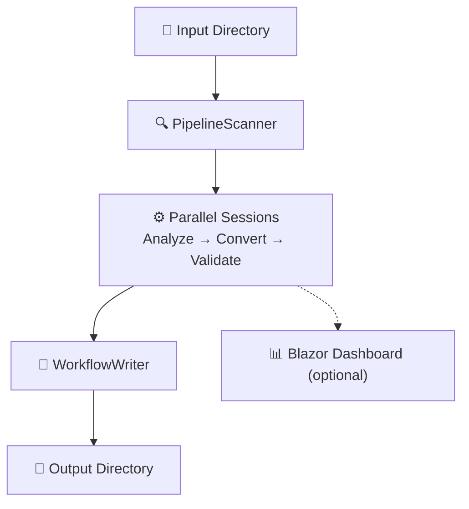

# Pipeline to GitHub Actions Converter

> ⚠️ **Experimental** — This project is under active development. Review generated workflows carefully before use in production.

A **.NET 10** application that converts CI/CD pipelines from **GitLab CI**, **Azure DevOps**, and **Jenkins** to **GitHub Actions** using the [GitHub Copilot SDK](https://github.com/github/copilot-sdk).

[View on GitHub »](https://github.com/Frank802/ghcp-action-importer){: .btn .btn-primary}
[Get Started »](#-quick-start){: .btn}

---

## ✨ Features

- 🔀 **Multi-source support** — Convert pipelines from GitLab CI, Azure DevOps, and Jenkins
- 🤖 **AI-powered conversion** — Uses GitHub Copilot to intelligently map pipeline constructs
- 🔬 **Pre-conversion analysis** — Evaluates complexity, identifies risks, flags unsupported features
- 📝 **Custom prompts** — Customizable prompt files drive each phase (analysis, conversion, validation)
- ✅ **Validation** — Checks YAML syntax, GitHub Actions structure, security, and action version pinning
- 📊 **Live web dashboard** — Optional Blazor Server dashboard for real-time progress monitoring
- 🧩 **Extensible** — `IPipelineSource` interface for easy addition of new pipeline formats
- 📑 **Detailed reports** — Analysis and validation reports with suggestions for improvements
- ⚡ **Parallel processing** — Multiple pipelines processed concurrently in independent Copilot sessions

---

## 🛠 How It Works



1. **Scan** — Discover pipeline files by matching against `IPipelineSource` patterns.
2. **Analyze** — Copilot evaluates complexity (Low/Medium/High/Critical), risks, and unsupported features.
3. **Convert** — In the same session, Copilot produces a GitHub Actions workflow informed by analysis findings.
4. **Validate** — Copilot checks syntax, security, and action pinning, producing an improved workflow.
5. **Write** — Save the workflow plus `.analysis.md` and `.validation.md` reports.

---

## 📋 Prerequisites

- [.NET 10 SDK](https://dotnet.microsoft.com/download)
- [GitHub Copilot CLI](https://docs.github.com/en/copilot/how-tos/set-up/install-copilot-cli) installed and authenticated
- Active GitHub Copilot subscription

---

## 🚀 Quick Start

```bash
git clone https://github.com/Frank802/ghcp-action-importer.git
cd ghcp-action-importer/src
dotnet build
dotnet run -- -i ../samples -o ../output -v
```

This converts the included samples:

- **GitLab CI** (`.gitlab-ci.yml`) — Node.js build/test/deploy
- **Azure DevOps** (`azure-pipelines.yml`) — .NET multi-stage
- **Jenkins** (`Jenkinsfile`) — Java Maven with Docker & Kubernetes

---

## 💻 Usage

```bash
# Basic
dotnet run -- -i <input-folder> -o <output-folder>

# Filter to GitLab only, verbose
dotnet run -- -i ./pipelines -o ./converted -s GitLab --verbose

# Launch live dashboard on port 5050
dotnet run -- -i ./ci -o ./output -p 5050
```

### Command Line Options

| Option | Alias | Description |
|--------|-------|-------------|
| `--input` | `-i` | **Required.** Input directory containing pipeline files |
| `--output` | `-o` | **Required.** Output directory for converted workflows |
| `--source` | `-s` | Filter: `GitLab`, `AzureDevOps`, `Jenkins` |
| `--max-sessions` | `-m` | Max parallel Copilot sessions (default: 3) |
| `--port` | `-p` | Start the Blazor dashboard on the given port |
| `--skip-validation` | | Skip validation step |
| `--skip-analysis` | | Skip pre-conversion analysis |
| `--verbose` | `-v` | Enable verbose output |

---

## 📦 Supported Pipeline Formats

| Source | File Patterns |
|--------|---------------|
| GitLab CI/CD | `.gitlab-ci.yml`, `.gitlab-ci.yaml` |
| Azure DevOps | `azure-pipelines.yml`, `azure-pipelines.yaml` |
| Jenkins | `Jenkinsfile`, `Jenkinsfile.*` |

---

## 🔌 Extending with New Sources

Add support for a new pipeline format by implementing `IPipelineSource`:

```csharp
public class MyPipelineSource : IPipelineSource
{
    public PipelineType Type => PipelineType.MySource;
    public IReadOnlyList<string> FilePatterns => ["my-pipeline.yml"];

    public bool CanHandle(string filePath, string? content = null) { ... }
    public PipelineInfo ExtractInfo(string filePath, string content) { ... }
}
```

Then add the type to the `PipelineType` enum and register the source in `Program.cs`.

---

## 📚 Learn More

- 📖 [Full README on GitHub](https://github.com/Frank802/ghcp-action-importer#readme)
- 🐛 [Report an Issue](https://github.com/Frank802/ghcp-action-importer/issues)
- 🤝 [Contribute](https://github.com/Frank802/ghcp-action-importer/pulls)
- 📦 [GitHub Copilot SDK](https://github.com/github/copilot-sdk)

---

<p style="text-align:center; color:#666;">
Released under the MIT License.
</p>
